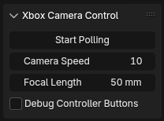

# Xbox Camera Control (Blender Addon)

Xbox Camera Control is a Blender Addon that allows you to control the scene camera using an Xbox S series controller. You can seamlessly switch between cameras, adjust the focal length, and perform common camera actions directly from your controller.

## Features

* Navigate the scene camera in real-time with Xbox controller thumbsticks.
* Perform camera actions with button presses:

  * **A Button**: Camera View
  * **X Button**: Align Camera to View
  * **B Button**: Align Camera to Selected
  * **Y Button**: Render Scene
  * **DPAD Left/Right**: Cycle through cameras
  * **DPAD Up/Down**: Cycle through camera focal length profiles
* Adjust camera movement speed and focal length on the fly.
* Toggle debug information for detailed button states.

## Installation

1. Download the [latest release](https://github.com/HoussemEJ/Xbox-Camera-Control/releases/latest) of Xbox Camera Control.

### Method 1: Preferences Install

* In Blender 4.4, go to `Edit -> Preferences -> Add-ons`.
* Click the `Install from disk...` button at the top-right corner.
* Select the downloaded zip file and click `Install from disk`.
* Enable the addon by checking the box next to **Xbox Camera Control**.

### Method 2: Drag-and-Drop

* Simply drag the downloaded zip file into the Blender 3D Viewport.
* Blender will prompt you to install the addon directly.
* Enable it from the pop-up menu or the Preferences window.

The panel will appear in the `N-Panel` under the **5Th-Dimension** category.

## Usage

1. Connect your Xbox controller to your computer.
2. Open the `N-Panel` under `5Th-Dimension -> Xbox Camera Control`.
3. Click `Start Polling` to begin listening to controller inputs.
4. Use the controller buttons and thumbsticks to navigate the camera.

### Controller Mappings:

* **A** - Camera View
* **X** - Align Camera to View
* **B** - Align Camera to Selected
* **Y** - Render Scene
* **DPAD Left** - Cycle to Previous Camera
* **DPAD Right** - Cycle to Next Camera
* **DPAD Up** - Previous Camera Profile
* **DPAD Down** - Next Camera Profile
* **RB / LB** - Rotate camera horizontally
* **Left/Right Trigger** - Move camera up/down
* **Left thumbstick** - Move camera position
* **Right thumbstick** - Adjust camera orientation

## Camera Profiles

Xbox Camera Control includes a range of predefined camera profiles, each corresponding to a specific focal length for different cinematic or practical effects:

* **Fisheye Madness (10mm)**: Ultra-wide and distorted view, perfect for dynamic shots or unique perspective effects.
* **Architect's Dream (18mm)**: Wide-angle lens ideal for capturing large scenes or architectural layouts.
* **Street Classic (24mm)**: Classic street photography focal length that balances wide perspective with minimal distortion.
* **Everyday Cinema (35mm)**: Standard cinematic focal length for balanced, natural-looking shots.
* **Portrait Standard (50mm)**: Perfect for capturing portraits with a natural perspective and good background separation.
* **Soft Close-Up (85mm)**: Ideal for close-up shots with excellent depth of field and background compression.
* **Telescope Feel (135mm)**: Long focal length for capturing distant subjects with high detail.

Switch between these profiles with the **DPAD Up/Down** buttons during Xbox controller navigation.

## Panel Overview

* **Start Polling** - Begin listening to Xbox controller inputs.
* **Camera Speed** - Adjusts the movement speed of the camera.
* **Focal Length** - Modify the focal length of the active camera.
* **Debug Controller Buttons** - Display controller state information for debugging.

## Dependencies

* Blender 4.4.0 or newer.
* Supports Windows (x64).
* Xbox S series controller.

## Troubleshooting

* **No controller detected**: Ensure your Xbox controller is connected before starting polling.
* **No camera found**: Make sure your scene has at least one camera. The addon will attempt to auto-select one if available.
* **Polling stops unexpectedly**: Check if the polling checkbox is still active.

## License

This addon is licensed under [CC BY-NC-SA 4.0](https://creativecommons.org/licenses/by-nc-sa/4.0/)

## Author

Developed by Houssemeddine Jebali.

## Contributing

Pull requests are welcome. For major changes, please open an issue first to discuss what you would like to change.

## Contact

For questions or support, feel free to reach out via GitHub issues.
